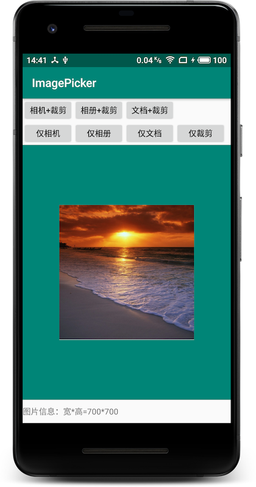

# ImagePicker

[](https://bintray.com/wrs/maven/ImagePicker/_latestVersion)

## 背景

开发App过程中经常会有选择图片、裁剪图片的需求。实现该需求最快的方式就是通过隐式调用来调起系统提供的相机、图库UI、文档UI来进行选择，通过`ACTION`为`com.android.camera.action.CROP`的隐式调用来调起裁剪。

## 简介

该库提供快速从系统相机、图库UI或文档UI选择图片并裁剪的功能，包含Android 6.0开始动态权限申请（文件存储权限）以及7.0文件协议（FileProvider）的处理。

核心功能拍照、选图、裁剪可自由搭配使用或单独使用，同时未内嵌UI，项目可高度定制自己的UI。

Demo介绍了常用的使用方式：



## 主要功能

1.选图功能：从相机、图库UI、文档UI选择图片；

2.裁剪功能；

3.选图+裁剪组合使用；

## 使用方式

`build.gradle`添加依赖：

```groovy
// 确保仓库已添加jcenter()
allprojects {
    repositories {
        ...
        jcenter()
    }
}

// 添加依赖
dependencies {
	compile 'com.lancewu:ImagePicker:<version>' 
}
```

`<version>`请替换为对应的版本号。

### e.g.拍照+裁剪

需求：从相机拍照并裁剪得到一张200*400的图片；

实现代码如下：

```java
public void clickCameraCrop(View view) {
    // 从相机拍照并裁剪
    File file = new File(getExternalCacheDir(), "camera_crop.jpg");
    // 创建裁剪参数
    ImagePicker.CropConfigBuilder cropConfigBuilder = new ImagePicker.CropConfigBuilder()
            .aspect(1, 2) // 比例1：2
            .outputSize(200, 400) // 输出大小200*400
            .outputFile(file);  // 最终文件保存路径
    // 创建选择器
    mPicker = new ImagePicker.Builder(this)
            .fromCamera(file) // 表示从相机选择，并设置拍照保存文件
            .withCrop(cropConfigBuilder) // 拍照完紧接裁剪
            .build();
    // 调用选图
    mPicker.pick(mCallback);
}

private OnImagePickerCallback mCallback = new OnImagePickerCallback() {
    @Override
    public void onPickError(@ErrorCode int errorCode) {
        // 发生错误，具体错误参考：@ErrorCode
        showToast("ImagePicker-发生错误：" + errorCode);
    }

    @Override
    public void onPickSuccess(@NonNull ImagePickerResult result) {
        // 选图/裁剪回调
        InputStream inputStream = null;
        try {
            // 从选择结果中取出文件Uri，进行想要的处理，这边直接显示
            inputStream = getContentResolver().openInputStream(result.getImageUri());
            Bitmap bitmap = BitmapFactory.decodeStream(inputStream);
            mImageView.setImageBitmap(bitmap);
            String text = "图片信息：宽*高=" + bitmap.getWidth() + "*" +bitmap.getHeight();
            mInfoTv.setText(text);
        } catch (FileNotFoundException e) {
            e.printStackTrace();
        } finally {
            StreamUtils.close(inputStream);
        }
    }

    @Override
    public void onPickCancel() {
        // 主动取消选择/裁剪时回调
        showToast("ImagePicker-取消选择");
    }

    void showToast(String msg) {
        Toast.makeText(MainActivity.this, msg, Toast.LENGTH_SHORT).show();
    }
};
```

更详细的使用方式可参照Demo。

### 接口API

[API概览](docs/index.html) 

[核心API-选择功能设置：ImagePicker.Builder](docs/com/lancewu/imagepicker/ImagePicker.Builder.html) 

[核心API-裁剪参数设置：ImagePicker.CropConfigBuilder](docs/com/lancewu/imagepicker/ImagePicker.CropConfigBuilder.html) 

## Change Log

[Change Log](CHANGELOG.md)

## License

```txt
Copyright 2019 LanceWu

Licensed under the Apache License, Version 2.0 (the "License");
you may not use this file except in compliance with the License.
You may obtain a copy of the License at

 http://www.apache.org/licenses/LICENSE-2.0

Unless required by applicable law or agreed to in writing, software
distributed under the License is distributed on an "AS IS" BASIS,
WITHOUT WARRANTIES OR CONDITIONS OF ANY KIND, either express or implied.
See the License for the specific language governing permissions and
limitations under the License.
```
